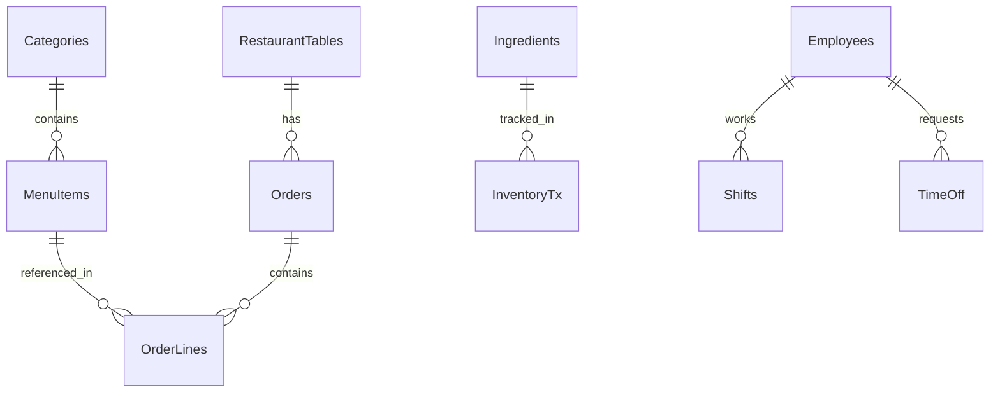
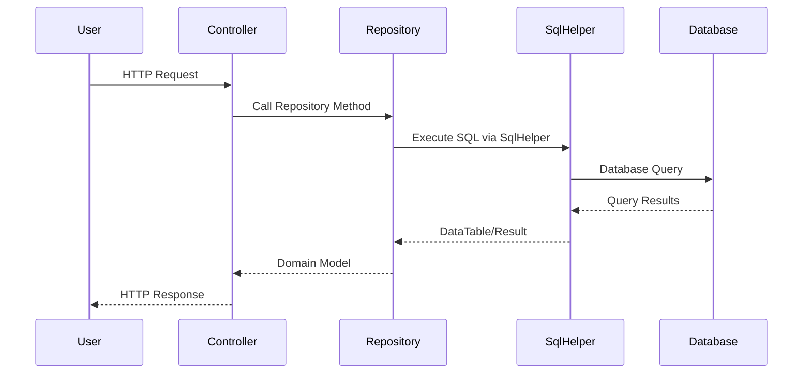
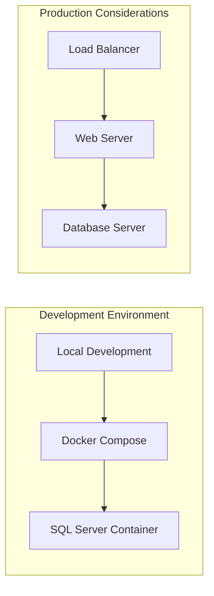

# RestaurantOps Legacy Application - Architecture Diagram

## Current Architecture Overview

The RestaurantOps application is a legacy ASP.NET Core MVC application built with .NET 9.0, following a traditional layered architecture pattern with direct database access using ADO.NET.

## System Architecture

```mermaid
graph TB
    subgraph "Client Layer"
        Browser[Web Browser]
    end
    
    subgraph "Presentation Layer"
        Views[Views (.cshtml)]
        Controllers[Controllers]
    end
    
    subgraph "Business Logic Layer"
        Repositories[Repository Classes]
    end
    
    subgraph "Data Access Layer"
        SqlHelper[SqlHelper Static Class]
    end
    
    subgraph "Data Storage"
        SQLServer[(SQL Server 2022)]
    end
    
    subgraph "Infrastructure"
        Docker[Docker Container]
    end
    
    Browser --> Views
    Views --> Controllers
    Controllers --> Repositories
    Repositories --> SqlHelper
    SqlHelper --> SQLServer
    SQLServer --> Docker
```

## Detailed Component Architecture

### 1. Presentation Layer
```
Controllers/
├── HomeController.cs          # Main landing page
├── InventoryController.cs     # Inventory management
├── KitchenDisplayController.cs # Kitchen order display
├── MenuController.cs          # Menu CRUD operations
├── OrderController.cs         # Order management
├── PaymentGatewayController.cs # Payment processing
├── ScheduleController.cs      # Employee scheduling
└── TablesController.cs        # Table management
```

### 2. Business Logic Layer
```
Repositories/
├── EmployeeRepository.cs      # Employee data operations
├── IngredientRepository.cs    # Ingredient management
├── InventoryRepository.cs     # Inventory tracking
├── MenuRepository.cs          # Menu item operations
├── OrderRepository.cs         # Order processing
├── ShiftRepository.cs         # Shift scheduling
└── TableRepository.cs         # Table operations
```

### 3. Data Models
```
Models/
├── Category.cs                # Menu categories
├── Employee.cs                # Employee information
├── Ingredient.cs              # Ingredient details
├── InventoryTx.cs             # Inventory transactions
├── MenuItem.cs                # Menu items
├── Order.cs                   # Order header
├── OrderLine.cs               # Order line items
├── PaymentRequest.cs          # Payment information
├── RestaurantTable.cs         # Table configuration
├── Shift.cs                   # Employee shifts
└── TimeOff.cs                 # Time-off requests
```

### 4. Data Access Layer
```
SqlHelper.cs                   # Static utility class for:
├── ExecuteDataTable()         # SELECT queries returning DataTable
├── ExecuteNonQuery()          # INSERT/UPDATE/DELETE operations
└── ExecuteScalar()            # Single value queries
```

## Database Schema



### Core Tables:
- **Categories**: Menu categorization
- **MenuItems**: Individual menu offerings
- **RestaurantTables**: Physical dining tables
- **Orders**: Order headers with status tracking
- **OrderLines**: Individual order items
- **Ingredients**: Raw material inventory
- **InventoryTx**: Inventory movement tracking
- **Employees**: Staff information
- **Shifts**: Work schedule management
- **TimeOff**: Leave request tracking

## Technology Stack

### Backend
- **Framework**: ASP.NET Core 9.0 (MVC)
- **Language**: C# 12
- **Database**: SQL Server 2022
- **Data Access**: ADO.NET with Microsoft.Data.SqlClient 6.0.2

### Infrastructure
- **Containerization**: Docker with SQL Server 2022 image
- **Platform**: Cross-platform (.NET 9.0)

### Frontend
- **View Engine**: Razor (.cshtml)
- **CSS Framework**: Bootstrap
- **JavaScript**: jQuery with validation

## Current Architecture Characteristics

### Strengths
- Simple, straightforward layered architecture
- Direct database access for performance
- Clear separation of concerns
- Modern .NET 9.0 framework

### Limitations
- **Tight Coupling**: Controllers directly instantiate repositories
- **No Dependency Injection**: Hard-coded dependencies
- **Static Data Access**: SqlHelper is a static class
- **No Unit Testing**: Difficult to test due to tight coupling
- **No Interface Abstractions**: Concrete implementations only
- **Synchronous Operations**: All database calls are blocking
- **No Caching**: Every request hits the database
- **No Logging**: Limited observability

## Data Flow



## Deployment Architecture



## Testing Structure

```
RestaurantOps.Tests/
├── Builders/                  # Test data builders
├── IntegrationTests/          # End-to-end tests
├── UnitTests/                 # Unit tests
└── TestResults/               # Test execution results
```

## Configuration

- **Connection String**: SQL Server with SA authentication
- **Environment**: Development configuration with detailed logging
- **Port**: SQL Server running on 1433
- **Authentication**: SQL Server authentication (not Windows)

## Recommendations for Modernization

1. **Implement Dependency Injection**: Use .NET's built-in DI container
2. **Add Interface Abstractions**: Create contracts for repositories and services
3. **Implement Unit Testing**: Mock dependencies for isolated testing
4. **Add Async/Await**: Convert to asynchronous database operations
5. **Implement Caching**: Add Redis or in-memory caching
6. **Add Logging**: Implement structured logging with Serilog
7. **Implement Validation**: Add FluentValidation for input validation
8. **Add API Layer**: Create REST API endpoints alongside MVC
9. **Implement Repository Pattern**: Proper abstraction over data access
10. **Add Health Checks**: Monitor application and database health

This architecture represents a typical legacy application that would benefit from modernization while maintaining its core business logic and functionality.
